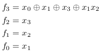
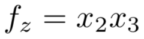
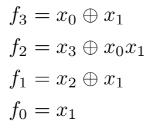
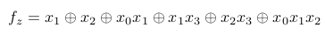
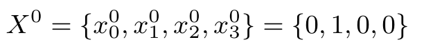

# Transformation Algorithms
We implement transformation algorithms for Type-I, Type-II, Type-III and Type-IV Galois NLFSRs.
For example, the transformation algorithms for Type-II Galois NLFSRs are Fibonacci-to-Type-II and 
Type-II-to-Fibonacci. We run the code on a 4-bit Fibonacci 
NLFSR and the 4-bit Galois NLFSR respectively.

# Scripts
Our algorithms are implemented in pure Python3, no any other
dependencies are required. There are 7 scripts in the directory
of 'algorithms_with_examples' and all these scripts can be executed independently.

Running them is pretty simple. For example, to run 'Fibonacci-to-Type-II.py' script, just
open your terminal or IDE and type `python Fibonacci-to-Type-II.py`. All the input
parameters are adjustable. More Details about these scripts are below.

#### 1. Fibonacci-to-Type-II.py
The implementation of the Fibonacci-to-Type-II transformation algorithm.  

For example, we transform a 4-bit Fibonacci NLFSR into all the possible
Type-II Galois NLFSRs.  
**Inputs:**  
Input parameters of the Fibonacci NLFSR.  
* The size of the Fibonacci NLFSR `n = 4`.
* The number of rounds to run the NLFSR `R = 1000`.
* The feedback functions of the Fibonacci NLFSR
`F = [[[1]], [[2]], [[3]], [[0], [1], [3], [1, 2]]]` denotes  
  
* The output function of the Fibonacci NLFSR `Z = [[2, 3]]` denotes  
  
* The randomly generated initial state of the Fibonacci NLFSR such as
`N0 = [0, 1, 1, 1]` denotes  
  
* The monomials to be shifted `M = [[1], [3], [1, 2]]` denotes monomials
x1, x3 and x1x2.

**Outputs:**  
Output all the possible equivalent Galois NLFSRs. For example, one of
the Galois NLFSR is represented by following parameters.  
* The end positions the monomials are shifted to `BFTG = [3, 1, 2]`
denote that x1 is not shifted, x3 is shifted to f1 and x1x2 is shifted to f2.  
* The compensation list `CFTG = [-1, -1, [[1]], [[2], [0, 1]]]` (-1 represents 0 in the description of the algorithm)  
* The feedback functions of the Galois NLFSR
`FFGal = [[[1]], [[2], [1]], [[3], [0, 1]], [[0], [1]]]` denotes  
  
* The output function of the Galois NLFSR `ZGal = [[1], [2], [0, 1], [1, 3], [2, 3], [0, 1, 2]]` denotes  
  
* The initial state of the Galois NLFSR `N0Gal = [0, 1, 0, 0]` denotes  

#### 2. Type-II-to-Fibonacci.py
The implementation of the Type-II-to-Fibonacci transformation algorithm
for Type-II Galois NLFSRs.  

The input Galois NLFSR must be a Type-II Galois NLFSR.  
For example, we run the code on the 4-bit Galois NLFSR obtained in Fibonacci-to-Type-II.py.  
**Outputs:**  
Output the original Galois NLFSR and the equivalent Fibonacci NLFSRs.  
* Feedback functions of the Galois NLFSR are:  [[[1]], [[2]], [[3]], [[0], [1], [3], [1, 2]]]  
* Output function of the Galois NLFSR is:  [[1], [2], [0, 1], [0, 1, 2], [1, 3], [2, 3]]  
* Initial state of the Galois NLFSR is:  [0, 1, 0, 0]  
* The combined compensation list is:  [-1, -1, [[2], [1]], [[3], [2], [0, 1]]]  
* Feedback functions of the Fibonacci NLFSR are:  [[[1]], [[2]], [[3]], [[0], [1], [3], [1, 2]]]  
* Output function of the Fibonacci NLFSR is:  [[2, 3]]
* Initial state of the Fibonacci NLFSR is:  [0, 1, 1, 1]  

The Galois NLFSR is transformed back to the Fibonacci NLFSR in Fibonacci-to-Type-II.py.  
