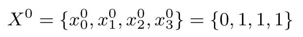

# Transformation Algorithms
We implement three transformation algorithms proposed in Theorem 1, 2, 3, 4
and run the code on the 256-bit Galois NLFSR in Espresso cipher, a 4-bit Fibonacci 
NLFSR, 4-bit Galois NLFSR and respectively.

We also implement the comparison of Espresso, Espresso-a and Espresso-b, and the 
comparison of Espresso, Espresso-F and Espresso-F2.

# Scripts
Our algorithms are implemented in pure Python3, no any other
dependencies are required. There are four scripts in the directory
of 'algorithms_with_examples' and all these scripts can be executed independently.

Running them is pretty simple. For example, to run 'Uniform_FTG.py' script, just
open your terminal or IDE and type `python Uniform_FTG.py`. All the input
parameters are adjustable. More Details about these scripts are below.

#### 1. Uniform_FTG.py
The implementation of the Uniform_Fibonacci-to-Galois transformation algorithm
proposed in Theorem 1.  

For example, we transform a 4-bit Fibonacci NLFSR into all the possible
uniform Galois NLFSRs.  
**Inputs:**  
Input parameters of the Fibonacci NLFSR.  
* The size of the Fibonacci NLFSR `n = 4`.
* The number of rounds to run the NLFSR `R = 1000`.
* The feedback functions of the Fibonacci NLFSR
`F = [[[1]], [[2]], [[3]], [[0], [1], [2], [1, 3]]]` denotes  
  
* The output function of the Fibonacci NLFSR `Z = [[3]]` denotes  
  
* The randomly generated initial state of the Fibonacci NLFSR such as
`N0 = [0, 0, 0, 1]` denotes  
  
* The monomials to be shifted `M = [[1], [2], [1, 3]]` denotes monomials
x1, x2 and x1x3.

**Outputs:**  
Output all the possible equivalent Galois NLFSRs. For example, one of
the Galois NLFSR is represented by following parameters.  
* The end positions the monomials are shifted to `BFTG = [3, 2, 3]`
denote that x1 and x1x3 are not shifted, x2 is shifted to f2.  
* The compensation list `CFTG = [-1, -1, -1, [1]]` (-1 represents 0 in Theorem 2)  
* The feedback functions of the Galois NLFSR
`FFGal = [[[1]], [[2]], [[3], [1]], [[0], [1, 3]]]` denotes  
  
* The output function of the Galois NLFSR `ZGal = [[3], [1]]` denotes  
  
* The initial state of the Galois NLFSR `N0Gal = [0, 0, 0, 1]` denotes  

#### 2. Uniform_GTF.py
The implementation of the Uniform_Galois-to-Fibonacci transformation algorithm
for uniform NLFSRs proposed in Theorem 2.  

The input Galois NLFSR must be an uniform NLFSR which satisfy conditions
in Definition 3.
For example, we run the code on the 256-bit Galois NLFSR
in Espresso cipher and successfully transform it into a LFSR with feedback
function below.  
  
The corresponding output function and the initial state of the LFSR
are output in the result. The length of the output function is the
number of monomials in the function.   

To be noted, all the uniform Galois NLFSRs transformed in this script
can be transformed by using Generalized_GTF.py as well.  

#### 3. Generalized_FTG.py
The implementation of the Generalized_Fibonacci-to-Galois transformation algorithm
proposed in Theorem 3.  

For example, we transform a 4-bit Fibonacci NLFSR into all the possible
equivalent Galois NLFSRs.  
**Inputs:**  
Input parameters of the Fibonacci NLFSR.  
* The size of the Fibonacci NLFSR `n = 4`.
* The number of rounds to run the NLFSR `R = 1000`.
* The feedback functions of the Fibonacci NLFSR
`F = [[[1]], [[2]], [[3]], [[0], [1], [2], [1, 3]]]` denotes  
  
* The output function of the Fibonacci NLFSR `Z = [[3]]` denotes  
  
* The randomly generated initial state of the Fibonacci NLFSR such as
`N0 = [0, 0, 0, 1]` denotes  
  
* The monomials to be shifted `M = [[1], [2], [1, 3]]` denotes monomials
x1, x2 and x1x3.

**Outputs:**  
Output all the possible equivalent Galois NLFSRs. For example, one of
the Galois NLFSR is represented by following parameters.  
* The end positions the monomials are shifted to `BFTG = [3, 2, 3]`
denote that x1 and x1x3 are not shifted, x2 is shifted to f2.  
* The compensation list `CFTG = [-1, -1, -1, [1]]` (-1 represents 0 in Theorem 2)  
* The feedback functions of the Galois NLFSR
`FFGal = [[[1]], [[2]], [[3], [1]], [[0], [1, 3]]]` denotes  
  
* The output function of the Galois NLFSR `ZGal = [[3], [1]]` denotes  
  
* The initial state of the Galois NLFSR `N0Gal = [0, 0, 0, 1]` denotes  

#### 4. Generalized_GTF.py
The implementation of the Generalized_Galois-to-Fibonacci transformation algorithm
proposed in Theorem 4.  

The feedbakc functions of the input Galois NLFSR must satisfy
equation (14) in the paper. We transform one of the Galois NLFSR in
the result of FTG.py back to the original Fibonacci NLFSR as an example.  
**Inputs:**  
Input parameters of the Galois NLFSR.  
* The size of the Galois NLFSR `n = 4`.
* The number of rouds to run the NLFSR `R = 1000`.
* The feedback functions of the Galois NLFSR
`FFGal = [[[1]], [[2]], [[3], [1]], [[0], [1, 3]]]`.
* The output function of the Galois NLFSR `ZGal = [[3], [1]]`.
* The randomly generated initial state of the Galois NLFSR such as
`N0Gal = [1, 1, 0, 1]`.

**Outputs:**  
Output the transformed NLFSR which is a Fibonacci NLFSR.  
* The compensation list is `CompenAll = [-1, -1, -1, [[3], [1]]]`.  
* The feedback functions of the Fibonacci NLFSR
`FFFib = [[[1]], [[2]], [[3]], [[0], [1, 3], [1], [2]]]`.  
* The output function of the Fibonacci NLFSR `ZFib = [[3]]`.  
* The initial state of the Fibonacci NLFSR `N0Fib = [1, 1, 0, 0]`.  
        
#### 5. Espresso_a_b.py
Compare the output sequence of the Espresso, Espresso-a and Espresso-b.   

The feedback functions `FFGal_a`and output function `ZGal_a` of the Espresso-a
are from reference [WL17] in the paper.
The parameters of Espresso-b are obtained from running GTF.py and FTG.py on
Espresso, which shows that the output function `FFGal_b` of Espresso-b has 104
variables and 1988 monomials. In the script, the parameter of the output
function `ZGal_b` reads from file ZGal_b.txt. 

The result shows that Espresso cipher is equivalent to Espresso-b not Espresso-a. 

#### 6. Espresso_F_F2.py
Compare the output sequence of the Espresso, Espresso-F and Espresso-F2.   

The feedback functions `FFGal_F`and output function `ZGal_F` of the Espresso-F
are from reference [DH17] in the paper.
The parameters of Espresso-F2 are obtained from running Uniform_FTG.py on
Espresso, which shows that the output function `FFGal_F2` of Espresso-F2 has 104
variables and 7942 monomials. In the script, the parameter of the output
function `ZGal_F2` and `ZGal_F2` reads from file ZGal_F2.txt and ZGal_F2.txt. 

The result shows that Espresso cipher is equivalent to Espresso-F2 not Espresso-F. 
